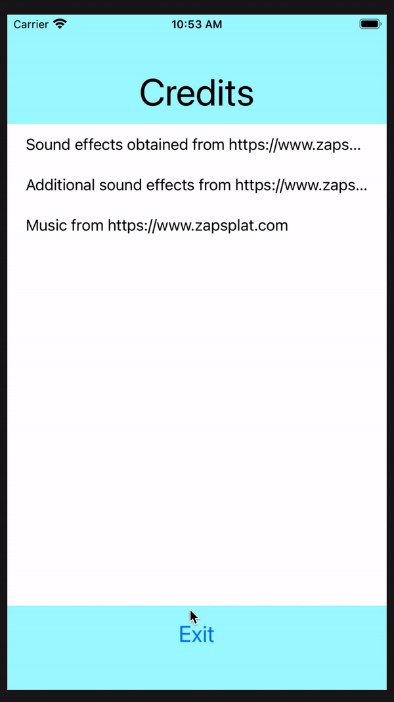

# Falling Valley

## About
A mobile game - Escape the falling rocks for as long as you can and don't fall down the valley. Strive to become the one to reach the highest heights in the infinite scrolling Falling Vally game.
[Progress](Dev\Progress\and\Updates/Updates.md)
[Bugs](Dev\Progress\and\Updates/Bugs.md)

### Goal
Survive as long as you can! Falling Valley is an infinite scroller in which the player must get their character survive for as long as they can without getting hit. The higher you go, the better the score.

#### How to Play
1. At the home screen, you have the play and characters buttons
    * Play will take you directly into the game
    * Characters allows you to choose a different skin for the character you want to play
2. Once you start playing, your character spawns on the rope, where they cannot fall, and only slowly move up
3. As the time starts, rocks will begin to fall from three different places on the screen, move to avoid them
    * Use swiping to move from side to side
4. When your character is off the rope, they are in the hands of gravity, make sure they jump up the walls to avoid falling off the sides!
    * Tap to jump when off the rope
5. A timer is there to keep track of how long you can survive! See what the best time you can get is.
    * As time goes on, the more frequently that rocks will fall
    
#### Demo

### Technologies
* SpriteKit
* Swift

### IDE
* Xcode

## Using the Project
As the project is new, it is only currently available via cloning and downloading here on Github

## Contributions
Create a fork of this project and then clone to your local repo

Create changes in branches before merging to master, and then you can make a pull request to the main project.

When make a pull request, document the changes made following [this template](https://embeddedartistry.com/blog/2017/08/04/a-github-pull-request-template-for-your-projects/).

## Goals
- [x] Character movement
- [x] Obstacle creation
- [x] Score
- [x] Scrolling screen
- [x] UI For home screen and end game screen
- [x] Applying good sprites

## To Do's
- [ ] Add GameCenter connection
- [ ] Add a form of persistence and a score screen
- [ ] Add more sounds
- [ ] Modularize

